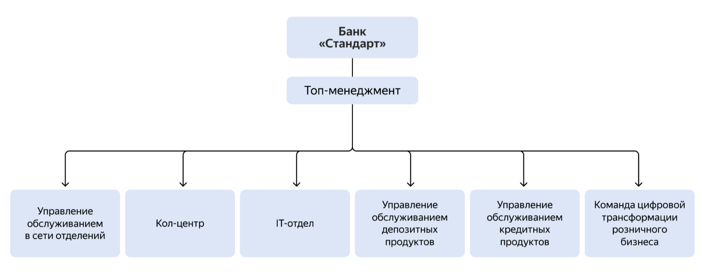

# Architecture standard project

## О банке «Стандарт»
У банка есть сайт и интернет-банк.

### Клиенты
Клиенты редко пользуются сайтом и интернет-банком. Основная категория клиентов банка — люди старшего возраста, которые предпочитают офлайн-обслуживание.

### Сайт
Отображает только маркетинговую информацию.

### Интернет-банк
Ограничивается проведением платежей и открытием текущих счетов (дебетовых карт).

### Сотрудники в отделении
Работают напрямую с автоматизированной банковской системой (АБС). Это основная система, где производится учёт операций по счетам и бухгалтерия. Чтобы реализовать возможность проведения платежей и открытия текущих счетов, интернет-банк интегрировали с АБС — напрямую с её базой данных.

### Сотрудники кол-центра
Принимают звонки через отдельную систему. Ещё при необходимости компания может подключать партнёрский кол-центр. Он работает по готовым скриптам звонков, которые ему передают бизнес-представители банка.

## Структура компании

### Фронт-офис
Менеджеры фронт-офисной системы работают с посетителями. Они несут ответственность за контактирование с людьми, маркетинг и продажи.

### Бэк-офис
Менеджеры бэк-офиса отвечают за деятельность компании на финансовых рынках и управление активами и пассивами банка. Они поддерживают внутренние бизнес-процессы, которые не видны клиентам.

### В структуре банка семь основных направлений:

#### Управление обслуживанием в сети отделений.
- 50 отделений в разных регионах;
- 500 человек (Менеджеры фронт-офиса).

#### Управление IT
- Команда Интернет-банк (Инсайд 10 человек)
- Команда Интернет-банк (Аутсорс 10 человек)
- Команда АБС (Инсайд 20 человек)

#### Управление обслуживанием депозитных продуктов.
- 50 человек (Менеджеры бэк-офиса).

#### Управление обслуживанием кредитных продуктов.
- 50 человек (Менеджеры бэк-офиса).

#### Кол-центр банка «Стандарт».
- 200 человек (Операторы)
- Система колл-центра от подрядчика (5 человек команда подрядчика)

#### Партнёрский кол-центр.
- 100 человек (Операторы)

#### Команда цифровой трансформации розничного бизнеса.
- 10 человек.

## IT-ландшафт компании

### Интернет-банк.
Клиент-серверная система на веб-фреймворке ASP.NET MVC 4.5 на основе .NET Framework 4.5 и СУБД MS SQL. Монолит реализован на платформе подрядчика. Команда банка может самостоятельно вносить изменения, но обновление ядра системы привязано к подрядчику. Интернет-банк работает на одной группе серверов в ЦОД. Также есть резервный ЦОД, на который можно переключиться в случае сбоя.

### Автоматизированная банковская система (АБС).
Интерфейс пользователей — это десктопный клиент на Delphi и СУБД на Oracle. Основная логика работы системы реализована процедурами на PL-SQL в СУБД. Система полностью разрабатывается внутри банка.

### Система кол-центра.
Это клиент-серверная система на платформе подрядчика, работает на технологиях подрядчика. Сама платформа предназначена для автоматизации CRM-решений, но банк использует только функционал кол-центра. У системы веб-интерфейс на React.js, бэкенд на Java Spring Boot и базы PostgreSQL. Архитектура микросервисная.

Система развёрнута в инфраструктуре банка и полностью поддерживается подрядчиком. В команде АБС есть несколько специалистов с опытом в Java-стеке. Они могут периодически вносить изменения в систему самостоятельно по просьбе бизнеса, поскольку она имеет возможности для расширения.

### Система партнёрского кол-центра.
Это внешняя система. Партнёрский кол-центр и подрядчик, чью систему использует кол-центра банка, — разные компании.

### СМС-шлюз телеком-оператора.
Его поддерживает IT-отдел банка, взаимодействуя с телеком-оператором.

### Телеком-оператор
Внешний оператор по отправке СМС.

### Сайт
Собственная разработка банка на PHP и React.js.

## Проблемы бизнеса
Чтобы развиваться дальше, компании нужно привлечь больше клиентов, которые относятся к более молодым категориям. Поэтому сейчас в приоритете развитие онлайн-каналов для привлечения и обслуживания клиентов. Бизнес нуждается в цифровой трансформации.

## Планы развития бизнеса
Компания планирует развивать сайт и интернет-банк, чтобы предоставлять больше продуктов онлайн.

### Две ключевые задачи.

####  Интернет-банк — открытие депозитов и накопительных счетов
«Стандарт» может выдавать кредиты и депозиты по ставкам, которые намного выгоднее, чем у большинства конкурентов. Поэтому руководство решило сделать упор на эти продукты в первую очередь.

Сейчас клиент может открыть депозитные и накопительные счета только в отделении банка. При этом задействованы и фронт-офис, и бэк-офис.

Цель на год — сделать так, чтобы клиент мог полностью автоматически открыть депозит или накопительный счёт в интернет-банке, а при обращении в отделение депозит открывался без участия сотрудников бэк-офиса. Но для этого сначала нужно реализовать MVP, где можно оформить заявку на депозит онлайн. Обрабатывать заявки продолжат сотрудники бэк-офиса.

#### Сайт — подача заявки на депозит
В ближайшей перспективе компания хочет, чтобы на сайте можно было подать заявку на депозит. Когда потенциальный клиент отправит заявку, с ним свяжется менеджер из кол-центра и расскажет об условиях по депозиту.

На следующем этапе банк планирует, что подать заявку на кредит можно будет и в интернет-банке, и на сайте. Кредитование — это значительно более важный процесс для банка, но его также гораздо сложнее реализовать онлайн. Поэтому сначала было решено сосредоточиться на процессе открытия депозитов.

## Цели бизнеса

### Через 6 месяцев
Клиент может открыть депозит или накопительный счёт в интернет-банке. В MVP бэк-офис может обрабатывать заявки по старому процессу.

### Через год
Клиент открывает депозит или накопительный счёт в интернет-банке. При этом бэк-офис не участвует в процессе — всё происходит автоматически без участия сотрудников банка. При обращении клиента в отделение банка задействованы только сотрудники фронт-офиса. Это позволит сократить операционные издержки на открытие новых депозитов.
