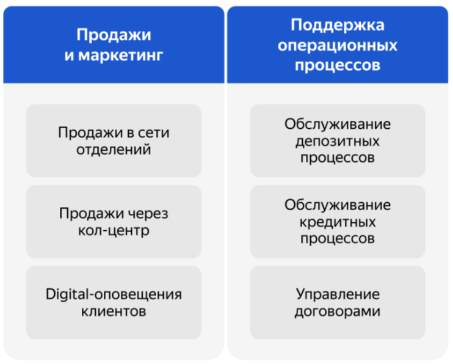

# Карта IT-ландшафта и схема интеграции приложений

## Что нужно сделать

Используя:
- Business Capability Map
- Описание организационной структуры предприятия и процессов.

### Создать карту текущего IT-ландшафта.
- В строках элементы организационной структуры
- В колонках бизнес-возможности второго уровня

Например, в строке стоит кол-центр, а в колонке — продажи через кол-центр.

### Создать схему интеграции приложений с указанием участников процессов.

## Business Capability Map

## Процесс открытия депозита

### Шаг 1
Клиент подает заявку на открытие депозита только в отделении. Сотрудники отдела кредитования вручную считают ставки в Excel-файле на основе ставки рефинансирования Центробанка. Они анализируют текущее количество выданных кредитов и депозитов в банке. Итоговая ставка по депозитам зависит от уровня кредитного риска банка. Она обновляется ежедневно — эти показатели передаются в бэк-офис каждый день по почте Excel-файлом.

### Шаг 2
Если до своего визита клиент позвонил в кол-центр, чтобы уточнить детали открытия депозита, то сотрудник кол-центра заводит обращение в своей системе. Оно передаётся в АБС.

Сотрудники бэк-офиса отдельно обрабатывают заявки из кол-центра в АБС, чтобы определить ставки для таких клиентов заранее. Если ставка определена, то сотрудник обрабатывает заявку в АБС и указывает там ставку. 

После этого АБС отправляет СМС-оповещение клиенту о том, что он может получить депозит под указанную ставку, — для этого надо прийти в отделение.

### Шаг 3
Если клиент приходит в отделение без предварительного звонка, то его заявку нельзя обработать заранее. В этом случае, чтобы озвучить клиенту ставку депозита, сотрудник отделения пишет письмо сотруднику бэк-офиса.

### Шаг 4
Если у клиента достаточно много денег на счетах, ему могут согласовать специальные ставки. Чтобы их определить, сотрудники бэк-офиса обращаются в отдел кредитования. 

Сотрудник кредитования анализирует текущий уровень кредитного риска для банка в своём разделе АБС относительно этого клиента и передаёт данные в письме.

Эти данные менеджер депозитов добавляет в Excel-файл и вычисляет на их основе ставку. Он посылает её ответным письмом сотруднику фронт-офиса.

### Шаг 5
Процесс выглядит так, потому что сотрудники депозитов и сотрудники кредитов не должны иметь доступа к данным друг друга по требованиям безопасности.

Когда клиент узнаёт ставку и подтверждает открытие депозита, сотрудник фронт-офиса создаёт депозит в АБС и выдаёт клиенту необходимые документы. Когда документы подписаны, сотрудник загружает их в АБС.

Пока проходят все этапы согласования, клиент ожидает в отделении. Обычно всё происходит в течение 20 минут. В случае специальных ставок процесс может занимать до часа.
