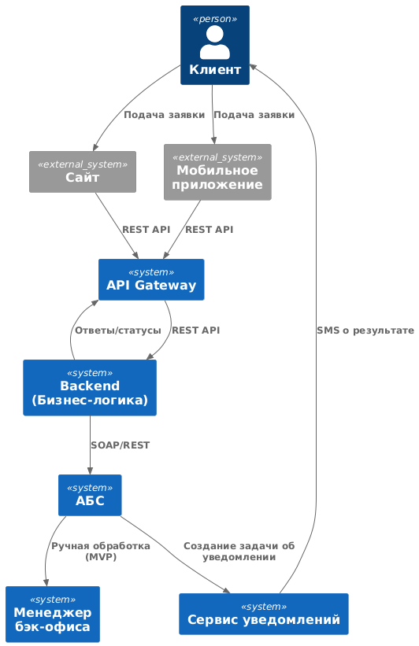
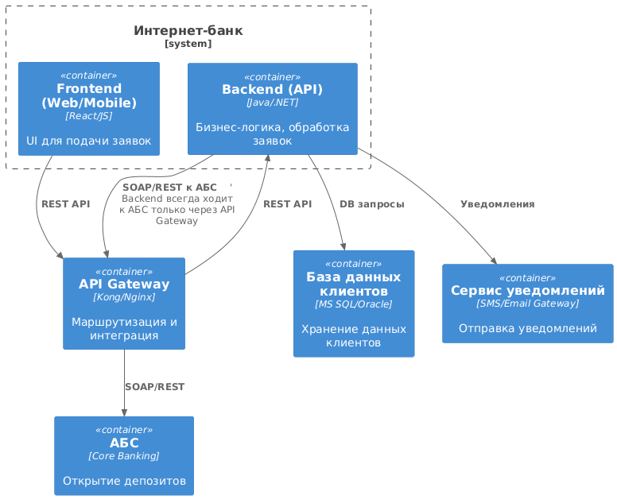

### **Название задачи: Открытие депозитов онлайн (MVP)**
### **Автор: Спичихин Я. А.**
### **Дата: 2025-07-11**


### **Функциональные требования**

| **№** | **Действующие лица или системы**                 | **Use Case**             | **Описание**                                                                                                       |
| :---: | :----------------------------------------------- | :----------------------- | :----------------------------------------------------------------------------------------------------------------- |
|   1   | Клиент, Сайт, Мобильное приложение               | Подача заявки на депозит | Клиент выбирает депозит, указывает сумму и счёт, подтверждает заявку через СМС-код.                                |
|   2   | Сайт, Мобильное приложение, API Gateway, Backend | Обработка заявки         | Данные клиента, передаются в бизнес логику бэкенда через API Gateway                                               |
|   3   | Backend, API Gateway, АБС                        | Обработка заявки         | Система проверяет данные клиента, отправляет запрос в АБС через API Gateway.                                       |
|   4   | АБС, Менеджер бэк-офиса                          | Ручная обработка (MVP)   | Менеджер подтверждает условия депозита и открывает его в АБС вручную.                                              |
|   5   | АБС, Сервис уведомлений                          | Уведомление              | АБС после открытия депозита создает задачу об уведомлении, сервис уведомлений отправляет СМС клиенту о результате. |


### **Нефункциональные требования**

| **№** | **Требование**                                                                                         |
| :---: | :----------------------------------------------------------------------------------------------------- |
|   1   | SLA 99.9% для сервисов, 24/7, отказоустойчивость (2 ЦОД, health-check, горизонтальное масштабирование) |
|   2   | Время отклика ≤ 200 мс, загрузка интерфейса ≤ 1 сек (кэширование, CDN, оптимизация API)                |
|   3   | TLS 1.2+, шифрование трафика, секреты в vault, соответствие 152-ФЗ                                     |
|   4   | Swagger/OpenAPI, CI/CD, автотесты, документация, пайплайны                                             |
|   5   | Только интеграция через шину/прослойку, не напрямую к АБС                                              |
|   6   | Микросервисная архитектура для депозитов, независимое масштабирование                                  |
|   7   | Использование MS SQL/Oracle для хранения, Kafka/очереди для асинхронности                              |
|   8   | SMS — только через существующий шлюз, без доработки ядра ИБ                                            |
|   9   | Резервный ЦОД, auto failover ≤ 5 мин                                                                   |


### **Решение**


#### Диаграмма контекста (C4, PlantUML)



```plantuml
@startuml
!include https://raw.githubusercontent.com/plantuml-stdlib/C4-PlantUML/master/C4_Context.puml

Person(client, "Клиент")
System_Ext(web, "Сайт")
System_Ext(mobile, "Мобильное приложение")
System(backend, "Backend (Бизнес-логика)")
System(api, "API Gateway")
System(abs, "АБС")
System(notify, "Сервис уведомлений")
System(manager, "Менеджер бэк-офиса")

Rel(client, web, "Подача заявки")
Rel(client, mobile, "Подача заявки")
Rel(web, api, "REST API")
Rel(mobile, api, "REST API")
Rel(api, backend, "REST API")
Rel(backend, api, "Ответы/статусы")
Rel(backend, abs, "SOAP/REST")
Rel(abs, manager, "Ручная обработка (MVP)")
Rel(abs, notify, "Создание задачи об уведомлении")
Rel(notify, client, "SMS о результате")
@enduml
```


#### Диаграмма контейнеров (C4, PlantUML)



```plantuml
@startuml
!include https://raw.githubusercontent.com/plantuml-stdlib/C4-PlantUML/master/C4_Container.puml

System_Boundary(ibs, "Интернет-банк") {
  Container(fe, "Frontend (Web/Mobile)", "React/JS", "UI для подачи заявок")
  Container(be, "Backend (API)", "Java/.NET", "Бизнес-логика, обработка заявок")
}
Container(api, "API Gateway", "Kong/Nginx", "Маршрутизация и интеграция")
Container(abs, "АБС", "Core Banking", "Открытие депозитов")
Container(db, "База данных клиентов", "MS SQL/Oracle", "Хранение данных клиентов")
Container(notify, "Сервис уведомлений", "SMS/Email Gateway", "Отправка уведомлений")

Rel(fe, api, "REST API")
Rel(api, be, "REST API")
Rel(be, api, "SOAP/REST к АБС")    ' Backend всегда ходит к АБС только через API Gateway
Rel(api, abs, "SOAP/REST")
Rel(be, db, "DB запросы")
Rel(be, notify, "Уведомления")
@enduml
```


### **Альтернативы**
- Прямая интеграция интернет-банка с АБС (отказались из-за рисков и ограничений по безопасности).
- Использование XLS-файлов для ставок (устаревший подход, заменён на централизованный сервис ставок).
- Полная автоматизация обработки заявок (на этапе MVP реализована ручная обработка для ускорения запуска).

**Недостатки, ограничения, риски**
- Ограничения по масштабированию АБС (только вертикальное масштабирование).
- Возможные задержки при ручной обработке заявок в MVP.
- Необходимость интеграции с существующими шлюзами SMS и соблюдение всех регуляторных требований.
- Требуется экспертиза по новым технологиям (Kafka, микросервисы) для дальнейшего развития. 
