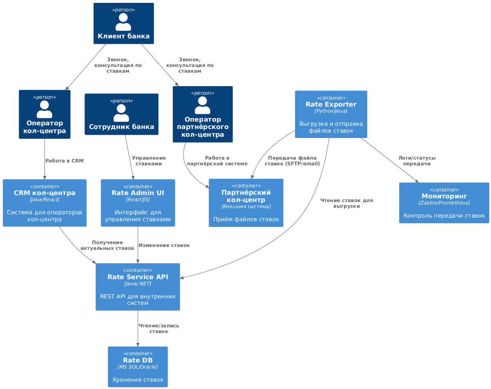

### **Название задачи: Передача ставок в кол-центр**
### **Автор: Спичихин Я. А.**
### **Дата: 2025-07-11**


### **Функциональные требования**

| **№** | **Действующие лица или системы**    | **Use Case**                     | **Описание**                                                                              |
| :---: | :---------------------------------- | :------------------------------- | :---------------------------------------------------------------------------------------- |
|   1   | Сотрудник банка, Rate Service       | Ввод/коррекция ставок            | Сотрудник вручную вносит или корректирует ставки через интерфейс Rate Service.            |
|   2   | Клиент, Оператор кол-центра         | Консультация по ставкам          | Клиент звонит в кол-центр, оператор предоставляет текущие ставки.                         |
|   3   | Кол-центр, Rate Service             | Получение ставок по API          | Система кол-центра запрашивает актуальные ставки через API Rate Service.                  |
|   4   | Rate Service, Партнёрский кол-центр | Выгрузка и передача файла ставок | Rate Service формирует файл ставок и отправляет его партнёрскому кол-центру (SFTP/email). |
|   5   | Rate Service, Мониторинг            | Контроль передачи ставок         | Система мониторинга отслеживает успешность передачи ставок и оповещает о сбоях.           |


### **Нефункциональные требования**

| **№** | **Требование**                                              |
| :---: | :---------------------------------------------------------- |
|   1   | SLA 99.9% для Rate Service и интеграций                     |
|   2   | Время обновления ставок ≤ 10 мин после изменения            |
|   3   | Защищённая передача файлов (SFTP/email с шифрованием)       |
|   4   | Аудит изменений ставок, логирование передачи                |
|   5   | Масштабируемость Rate Service для поддержки роста обращений |
|   6   | Возможность интеграции с новыми каналами в будущем          |


### **Решение**

#### Диаграмма контекста (C4, PlantUML)


```plantuml
@startuml
!include https://raw.githubusercontent.com/plantuml-stdlib/C4-PlantUML/master/C4_Context.puml

Person(client, "Клиент банка")
Person(employee, "Сотрудник банка")
Person(operator, "Оператор кол-центра")
Person(partner_operator, "Оператор партнёрского кол-центра")
System(rate, "Rate Service")
System(cc, "Кол-центр банка")
System(partnercc, "Партнёрский кол-центр")
System(monitor, "Система мониторинга")

Rel(client, operator, "Звонок, вопрос о ставках")
Rel(client, partner_operator, "Звонок, вопрос о ставках")
Rel(operator, cc, "Работа в системе кол-системе")
Rel(partner_operator, partnercc, "Работа в партнёрской системе кол-центра")
Rel(employee, rate, "Ввод/коррекция ставок")
Rel(cc, rate, "Получение ставок по API")
Rel(rate, partnercc, "Выгрузка и передача файла ставок")
Rel(rate, monitor, "Логи/статусы передачи")
@enduml
```

#### Диаграмма контейнеров (C4, PlantUML)




```plantuml
@startuml
!include https://raw.githubusercontent.com/plantuml-stdlib/C4-PlantUML/master/C4_Container.puml

Person(client, "Клиент банка")
Person(employee, "Сотрудник банка")
Person(operator, "Оператор кол-центра")
Person(partner_operator, "Оператор партнёрского кол-центра")

Container(rate_api, "Rate Service API", "Java/.NET", "REST API для внутренних систем")
Container(rate_db, "Rate DB", "MS SQL/Oracle", "Хранение ставок")
Container(rate_admin, "Rate Admin UI", "React/JS", "Интерфейс для управления ставками")
Container(rate_export, "Rate Exporter", "Python/Java", "Выгрузка и отправка файлов ставок")
Container(cc_crm, "CRM кол-центра", "Java/React", "Система для операторов кол-центра")
Container(partnercc, "Партнёрский кол-центр", "Внешняя система", "Приём файлов ставок")
Container(monitor, "Мониторинг", "Zabbix/Prometheus", "Контроль передачи ставок")

Rel(client, operator, "Звонок, консультация по ставкам")
Rel(client, partner_operator, "Звонок, консультация по ставкам")
Rel(operator, cc_crm, "Работа в CRM")
Rel(partner_operator, partnercc, "Работа в партнёрской системе")
Rel(employee, rate_admin, "Управление ставками")
Rel(rate_admin, rate_api, "Изменение ставок")
Rel(rate_api, rate_db, "Чтение/запись ставок")
Rel(cc_crm, rate_api, "Получение актуальных ставок")
Rel(rate_export, rate_api, "Чтение ставок для выгрузки")
Rel(rate_export, partnercc, "Передача файла ставок (SFTP/email)")
Rel(rate_export, monitor, "Логи/статусы передачи")
@enduml
```


### **Список крупных задач по системам**

**Rate Service:**
- Разработка API и базы данных для хранения ставок
- Создание административного интерфейса для управления ставками
- Реализация модуля выгрузки и отправки файлов ставок через API
- Интеграция с системой мониторинга

**Кол-центр собственный:**
- Интеграция кол-системы с Rate Service API
- Доработка интерфейса для отображения ставок операторам
- Обучение операторов работе с новым функционалом
- Тестирование получения актуальных ставок в реальном времени

**Партнёрский кол-центр:**
- Настройка приёма и обработки файлов ставок (на стороне партнёра)
- Интеграция файлов ставок в рабочие процессы партнёра
- Обучение операторов партнёра работе с новыми данными о ставках
- Настройка расписания обновления данных о ставках

**Инфраструктура/DevOps:**
- Настройка системы мониторинга передачи ставок
- Конфигурация расписания автоматической выгрузки и отправки файлов
- Обеспечение безопасности передачи данных (SFTP, шифрование)
- Настройка балансировки нагрузки между кол-центрами


### **RoadMap (MVP 6 мес. / целевое решение 12 мес.)**


**0-2 месяца:**
- Проектирование архитектуры Rate Service
- Разработка MVP Rate Service (API + административный интерфейс)
- Интеграция CRM кол-центра с Rate Service API

**2-4 месяца:**
- Реализация модуля выгрузки ставок в файл
- Настройка автоматической отправки файлов партнёрскому кол-центру
- Тестирование интеграции с партнёрским кол-центром

**4-6 месяцев:**
- Внедрение системы мониторинга и оповещений
- Обучение сотрудников, тестирование в продуктиве
- Запуск MVP в эксплуатацию

**6-12 месяцев:**
- Оптимизация производительности Rate Service
- Расширение функционала административного интерфейса
- Подготовка к интеграции с новыми каналами (сайт, интернет-банк)


### **Альтернативы**
- Проработка сервиса ставок внутри АБС (Усложнение вертикального монолита)

**Недостатки, ограничения, риски**
- Возможные сбои при передаче файлов партнёрскому кол-центру
- Временные задержки обновления ставок для партнёра (до следующей выгрузки)
- Человеческий фактор при ручном вводе и корректировке ставок
- Необходимость постоянного контроля актуальности ставок во всех системах
- Зависимость качества консультаций от оперативности обновления ставок в Rate Service 
